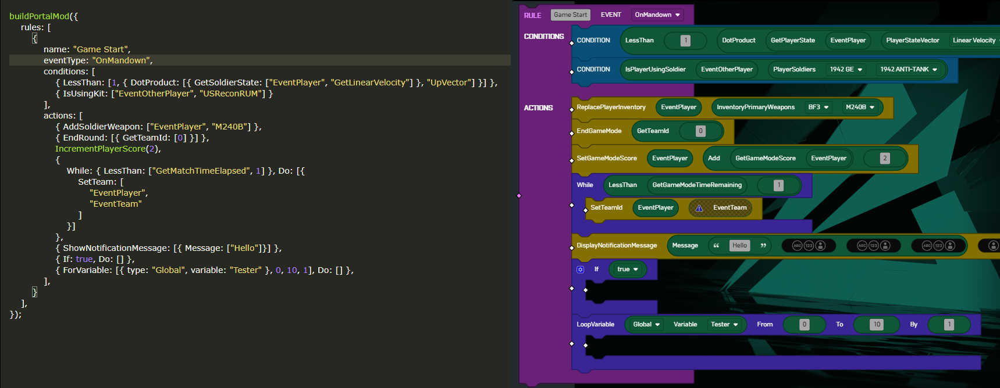

# Battlefield Portal Mod Builder

Use the full power of Typescript to construct your Battlefield Portal Mod!

## 🛠 Usage

* Run `npm install` to initialize the project
* Reference exampleMod.ts for basic usage
* Metaprogramming - Blocks can be added algorithmically/recursively, try it out!
* Typescript provides safety to Mod block structure, should not be allowed to add blocks that would result in invalid code
* Run `ts-node name-of-your-file.ts` to build out your Portal Mod files
* Copy contents of output-useable.xml to Battlefield Portal using [Battlefield Portal Extensions](https://chrome.google.com/webstore/detail/bf2042-portal-extensions/ojegdnmadhmgfijhiibianlhbkepdhlj) (Right-click -> "Paste From Clipboard")
* Editing recommended through VSCode, Sublime Text 4, JetBrains Webstorm etc. --- An IDE with native Typescript support, in order to get the most out of the tooling

## ♥ Contributions Welcome

> This is the very first crack at this kind of tool, if you have any changes you made that you'd like to share, please feel free to send a pull request. I will try to check into Discord Battlefield Portal for news as well. Thanks!
